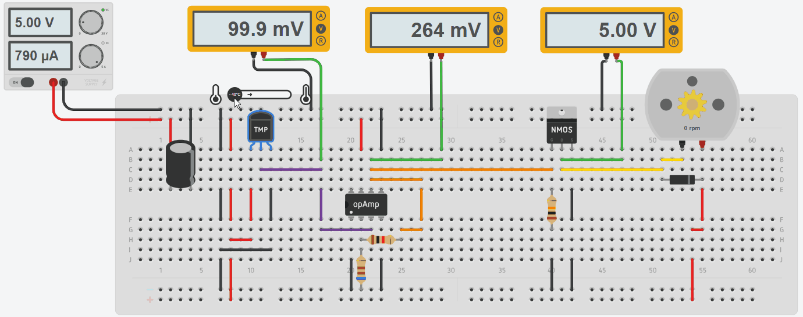

# 🌡️ Temperature-Controlled Fan

## 📝 Overview
This project implements an automatic temperature-controlled fan system using only analog components. The circuit uses a TMP36 temperature sensor to monitor ambient temperature and automatically adjusts the fan speed based on temperature readings, with the fan activating when the temperature reaches 25°C.

## 🔌 Circuit Design

The circuit consists of four main components:
1. TMP36 temperature sensor
2. 741 operational amplifier in non-inverting configuration
3. N-channel MOSFET (power transistor)
4. DC motor (fan)

### ⚙️ How It Works



The TMP36 temperature sensor produces a voltage output that is linearly proportional to the measured temperature. The sensor outputs 750mV at 25°C and increases by 10mV per degree Celsius. This voltage is then amplified by the 741 op-amp to provide sufficient voltage to drive the MOSFET gate.

When the temperature reaches 25°C (producing approximately 750mV), the amplified signal turns on the MOSFET, which allows current to flow through the DC motor, activating the fan. As the temperature increases further, the voltage increases proportionally, causing the MOSFET to conduct more current and therefore increase the fan speed.

### 📊 Op-Amp Calculations

For the non-inverting amplifier configuration:

```
Vout = Vin × (1 + R2/R1)
```

Where:
- Vin is the voltage from the TMP36 sensor
- R1 is the resistor connected to ground (610Ω)
- R2 is the feedback resistor (1000Ω)
- Vout is the amplified voltage applied to the MOSFET gate

At 25°C, the TMP36 outputs approximately 750mV. With our specific resistor values:
```
Vout = 0.750V × (1 + 1000/610)
Vout = 0.750V × (1 + 1.64)
Vout = 0.750V × 2.64
Vout = 1.98V ≈ 2V
```

This output voltage of 2V is exactly what we need to activate our MOSFET when the temperature reaches 25°C.

## 🛡️ Safety Features

The circuit includes several safety and protection features:
- A pull-down resistor on the MOSFET gate ensures the fan remains off when no signal is present
- A flyback diode across the motor protects the MOSFET from back-EMF voltage spikes when the motor turns off
- The op-amp circuit provides electrical isolation between the sensor and power components

## 🛒 Parts List

- TMP36 temperature sensor
- LM741 operational amplifier
- N-channel MOSFET (logic-level)
- DC motor
- 1N4001 flyback diode
- Resistors: 610Ω, 1kΩ, 10kΩ (pull-down)
- Power supply (9-12V DC)
- Breadboard and connecting wires

## 🚀 Applications

This temperature-controlled fan can be used in various applications:
- Computer CPU cooling
- Small electronics thermal management
- Greenhouse ventilation
- Simple thermostat systems
- Educational demonstrations of analog control systems

## 🔮 Future Improvements

Potential enhancements to the project could include:
- Adding a potentiometer to adjust the temperature threshold
- Incorporating LED indicators for different temperature ranges
- Adding a comparator circuit for more precise temperature control
- Implementing minimum and maximum speed limits

## 📄 License
[MIT License](LICENSE)

## 👤 Author

> Created by Yasteer Sewpersad

> Electronic Engineering Portfolio of Evidence
